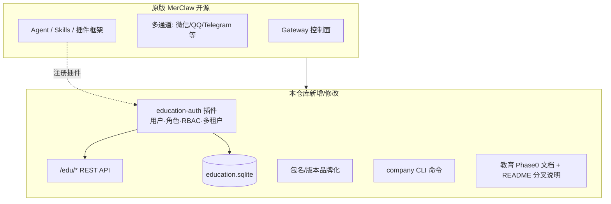

# mycompany-merclaw 与原版 MerClaw 差异说明（领导汇报版）

| 项目 | 内容 |
|------|------|
| **汇报对象** | 管理层 / 项目干系人 |
| **仓库** | https://github.com/chaser-y-jh/mycompany-merclaw |
| **上游基线** | [merclaw/merclaw](https://github.com/merclaw/merclaw)（开源个人 AI 助手） |
| **当前阶段** | Phase 0 已完成 |
| **日期** | 2026-06-02 |

---

## 一、一句话结论

**本仓库 = 原版 MerClaw 完整能力 + 面向 K12 教育的自研插件（用户/角色/权限/多校隔离）+ 少量品牌化与 CLI 扩展。**  

核心业务逻辑 **未改写** MerClaw 网关、多通道聊天、Agent 运行时；教育能力以 **独立插件** 形式叠加，便于升级上游、控制合规与交付风险。

---

## 二、与原版的关系（示意图）



---

## 三、改了什么 / 没改什么

### 3.1 未改动（沿用原版，占代码主体）

| 模块 | 说明 |
|------|------|
| `src/` 主程序 | Gateway、会话、Agent 编排、通道适配等 **保持上游架构** |
| 既有 `extensions/*` | 除新建 `education-auth` 外，均为原版扩展生态 |
| 通道能力 | WhatsApp、Telegram、微信、QQ 等 **与官方一致** |
| 部署形态 | 仍可按 MerClaw 方式本地/私有化运行 |

> Phase 0 设计原则：**零核心侵入**——教育能力通过官方插件 API（`registerHttpRoute` / `registerTool` / `registerService`）挂载。

### 3.2 自研新增（Phase 0 交付，可对外称为「我司教育版」）

| 类别 | 路径 | 作用 |
|------|------|------|
| **教育认证插件（核心）** | `extensions/education-auth/` | K12 用户体系、四类角色、RBAC、学校级数据隔离 |
| **阶段文档** | `docs/education-platform-phase0.md` | 技术交付说明与启用方式 |
| **分叉标识** | `README.md` 顶部警告框 | 明确「非官方仓库」，避免与 upstream 混淆 |
| **品牌化元数据** | `package.json` / `npm-shrinkwrap.json` | 包名 `mycompany-merclaw`，版本 `1.0.0-mycompany` |
| **CLI 扩展（轻量）** | `src/cli/program/register.company.ts` + `command-registry-core.ts` 注册 | `merclaw company info/status` 等公司信息命令 |

**自研插件文件清单（11 个文件）：**

```
extensions/education-auth/
├── index.ts                 # 插件入口：路由、工具、服务生命周期
├── merclaw.plugin.json     # 配置项（学校 ID、认证模式、是否允许自助注册等）
├── package.json
├── src/roles.ts             # 学生/教师/家长/管理员 + 权限矩阵
├── src/schema.ts            # SQLite 五张业务表
├── src/db.ts                # 数据库访问
├── src/rbac-middleware.ts     # 身份解析 + 权限校验
├── src/tenant-resolver.ts   # 多校隔离（school_id 作用域）
├── src/user-registry.ts     # 用户/班级 CRUD
├── src/api.ts               # /edu/* REST API
└── skills/manage-users/SKILL.md   # AI 侧用户管理技能说明
```

### 3.3 对上游核心的修改量（可量化）

| 类型 | 规模 | 说明 |
|------|------|------|
| 新建教育插件 | **~1,100+ 行 TypeScript/SQL/配置**（估算） | 独立目录，可单独评审与测试 |
| 核心 `src/` 修改 | **约 2 个文件、十余行级注册** | 仅增加 `company` 子命令注册，**不改变** Gateway/Agent 主流程 |
| 根目录 `package.json` | 元数据替换 | 名称、主页、支持链接等公司信息 |
| 运维脚本 | `push-to-github.ps1` 等 | 推送 GitHub 用，**不属于产品功能** |

---

## 四、Phase 0 业务能力说明（领导可读）

### 4.1 解决什么问题

原版 MerClaw 面向 **个人单用户** AI 助手，**没有** 学校场景下的：

- 学生 / 教师 / 家长 / 管理员身份
- 按角色限制「能问什么、能看什么数据」
- 多学校、多班级数据隔离

Phase 0 补齐 **「谁能用、能干什么、数据属于哪所学校」** 的基础治理层，为后续答疑、作业、学情等模块打底。

### 4.2 四类角色与权限（摘要）

| 角色 | 典型能力（示例） |
|------|------------------|
| **学生** | AI 答疑、交作业、看自己的成绩与测验 |
| **教师** | 批改/布置作业、看班级学情、备课出题 |
| **家长** | 查看关联子女学情与作业情况 |
| **管理员** | 用户与班级管理、全校配置（18 项权限，含全部教师/学生能力） |

权限在代码中以 `EduPermission` + `ROLE_PERMISSIONS` 矩阵实现，后续新功能只需 **声明权限点** 即可接入。

### 4.3 数据与接口

| 项目 | 说明 |
|------|------|
| **存储** | 本地 SQLite：`<数据目录>/education/education.sqlite` |
| **表** | 学校、用户、班级、选课关系、 schema 版本 |
| **HTTP API** | `/edu/me`、`/edu/users`、`/edu/classes`、`/edu/enrollments` 等，**均带 RBAC** |
| **AI 工具** | `lookup_edu_user`、`check_edu_permission` — Agent 可查询身份与权限 |
| **多租户** | 按 `schoolId` 自动隔离查询，适合单校私有化部署 |

### 4.4 配置开关（可按校启用）

在 `merclaw.json` 中启用插件即可，**默认关闭**，不影响原版个人助手用法：

- `schoolId` / `schoolName`：学校标识  
- `authMode`：手机号 / 用户名 / SSO（预留）  
- `allowSelfRegistration`：是否允许自助注册  
- `defaultRole`：新用户默认角色  

详细配置见 `docs/education-platform-phase0.md`。

---

## 五、业务价值（汇报用语）

1. **缩短交付周期**：复用 MerClaw 成熟多通道与 Agent 能力，避免从零做 IM 网关。  
2. **合规与可控**：用户与权限数据在本地 SQLite，适合校园私有化；插件化便于等保/审计扩展。  
3. **可持续演进**：核心与业务解耦，上游安全更新可合并；我司差异集中在 `education-auth`。  
4. **路线清晰**：Phase 0 已落地身份与权限；后续可迭代知识追踪、作业批改、家长端 UI 等（见下节）。

---

## 六、后续规划（建议口径）

| 阶段 | 内容 | 业务含义 |
|------|------|----------|
| **Phase 0** ✅ | 用户、角色、RBAC、多校隔离 | 已交付 |
| **Phase 1** | 知识点图谱 + 知识追踪 | 个性化学习路径 |
| **Phase 2** | 学生端：拍照答疑、分步讲解 | 核心教学体验 |
| **Phase 3** | 教师端：备课、出题、批改、报告 | 减轻教师负担 |
| **Phase 4** | Web/移动端：学生、教师、家长界面 | 可运营产品形态 |
| **Phase 5** | Docker 一键部署、内容安全、本地化 | 生产就绪 |

---

## 七、演示与验收建议（给领导看）

1. **说明分叉**：打开 GitHub 仓库，README 顶部黄色提示「非官方 MerClaw」。  
2. **启用教育插件**：展示 `merclaw.json` 中 `education-auth.enabled: true`。  
3. **API 演示**：`GET /edu/me`、`POST /edu/users` 创建管理员 → 创建班级 → 学生分班。  
4. **权限演示**：同一 Gateway 下，学生 token 无法调用 `homework:grade`，教师可以。  
5. **原版能力保留**：同一进程仍可走微信/QQ 等通道与 AI 对话（教育身份识别后接 Phase 1+ 业务）。

---

## 八、知识产权与合规提示（建议汇报时口头带一句）

- MerClaw 上游采用 **MIT** 等开源许可（以仓库 `LICENSE` 为准），fork 需保留版权声明。  
- 自研部分：`extensions/education-auth` 及公司品牌化文档，建议在内部明确 **著作权归属**（公司/项目）。  
- GitHub 公开仓库名 `mycompany-merclaw` 仅为托管命名，**对外宣传**建议使用正式产品名，并在 README 中保持「非官方」标识。

---

## 九、附录：与原版对比速查表

| 维度 | 原版 MerClaw | mycompany-merclaw（本仓库） |
|------|---------------|------------------------------|
| 定位 | 个人 AI 助手 | K12 教育机器人底座（进行中） |
| 用户模型 | 单用户 / 设备所有者 | 学生、教师、家长、管理员 |
| 权限控制 | 无细粒度教育 RBAC | 有，插件内实现 |
| 多校部署 | 无 | `schoolId` 租户隔离 |
| 数据存储 | 上游默认状态目录 | 额外 `education.sqlite` |
| REST API | 上游路由 | 增加 `/edu/*` |
| 核心 Gateway | 有 | **继承，未重写** |
| 品牌 | MerClaw | 包名/CLI/文档为公司定制 |

---

**编制说明**：本文档基于仓库内 `extensions/education-auth`、`docs/education-platform-phase0.md` 及 `package.json` 等文件整理，用于内部汇报；技术细节以代码与 Phase 0 文档为准。

**维护**：随 Phase 1 交付后更新第四节、第六节。
